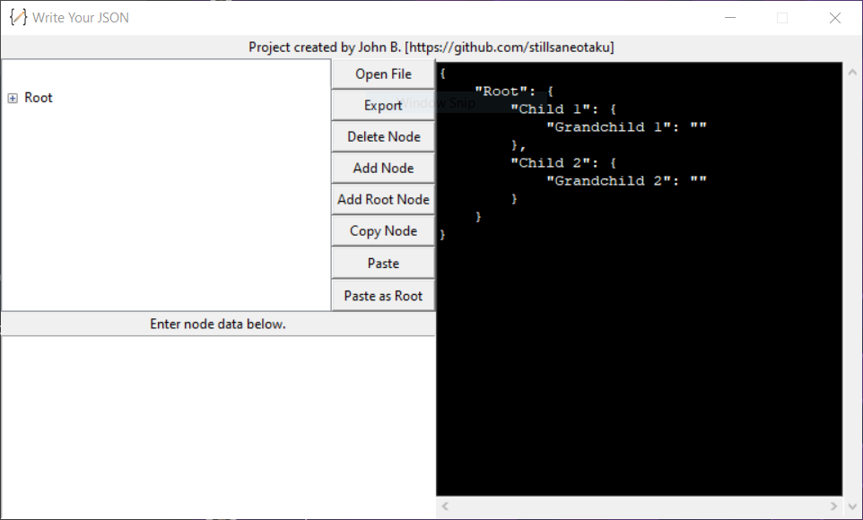
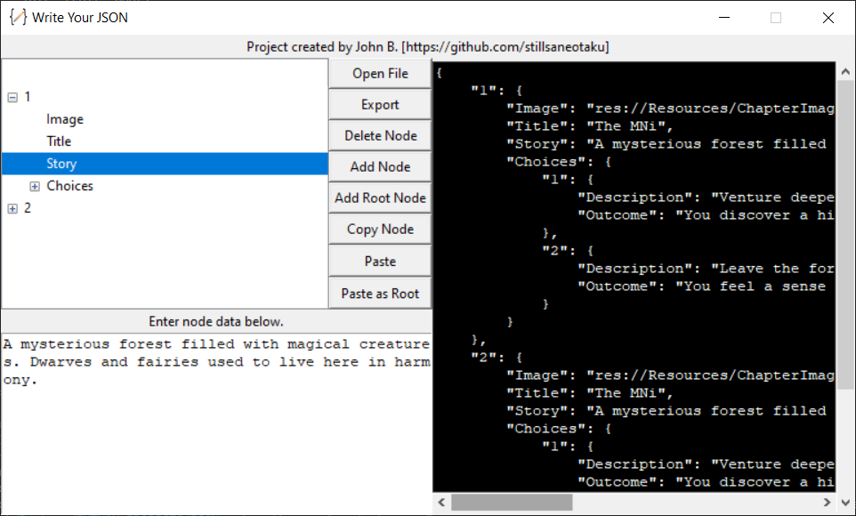

# Write-Your-JSON
A simple JSON writer that will adapt to your visual novel / text based game needs or anything else that you need it for.

Layout:

Example input:

Uses:
-I made this program in order to create JSON files for my in-progress text-based game. The capabilities so far are only
to open JSON files and edit them but it can be expanded to adapt to and read text documents in order to produce a JSON. 

How to use: 
In command prompt do 
[
    pip install pyinstaller
    pyinstaller --onefile --windowed --icon=icon.ico --add-data "icon.ico;." writer.py

    open dist/JSONwriter.exe

]

I hope you'll find some use for it in your own projects!
